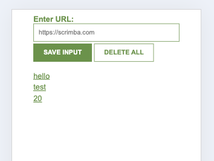

# 12. UrlLeadsTrackerApp

## Project discription

    The Leads Tracker exctention is now build in s progressive web app that can me run om mobile phones as a stand alone app. The use of database program Firebase to fetch realtime data. Place and remove leads in the app

## Live Project

Click <a href="https://14leads-tracker-app.netlify.app/"> here </a> to see the app

## Visual

    
## Design problem. 
Connecting the database with the app

## Solution.

import {
getDatabase,
ref,
push,
onValue,
remove
} from "https://www.gstatic.com/firebasejs/11.4.0/firebase-database.js"

const firebaseConfig = {
databaseURL: process.env.DATABASE_URL // fill in Api of Firebase here
}

const app = initializeApp(firebaseConfig)
const database = getDatabase(app)
const referenceInDB = ref(database, "leads")

## Design process and Tools.

This was a tutorial from Scrimba. Practising my HTML, CSS, JS and JSON
source: https://scrimba.com/playlist/pkrr5S9

##Results.
My first chrome extension

##What's Next.
What you have saved, make a download .txt file from this

## What have I learned?

<ul>
    <li>Const</li>
    <li>JaddEventListener("click",funtion(){}</li>
    <li>innerHTML</li>
    <li>input.value</li>
    <li>function parameters</li>
    <li>Template strings</li>
    <li>localStorage</li>
    <li>JSON object - parse - stringify</li>
    <li>manifest.json file for extensions</li>
    <li>objects in arrays</li>

</ul>
